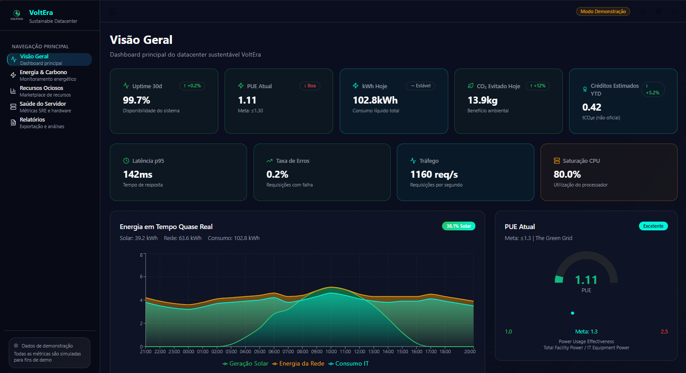
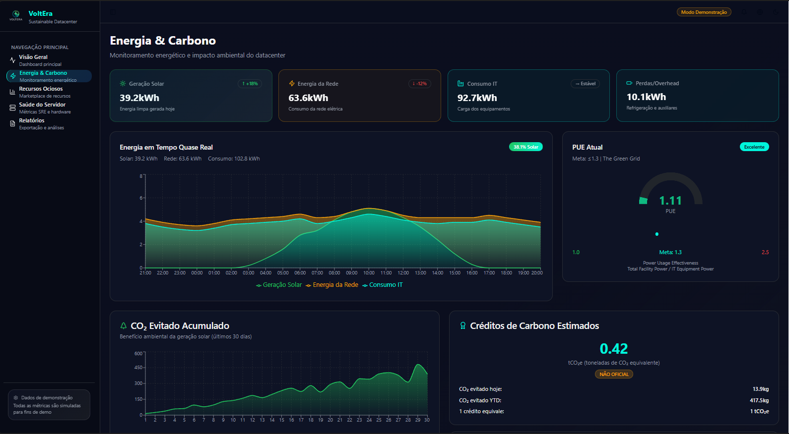
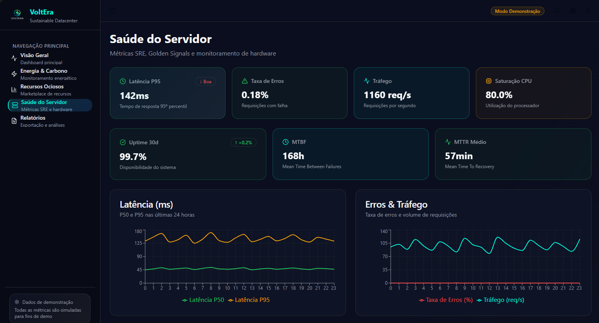
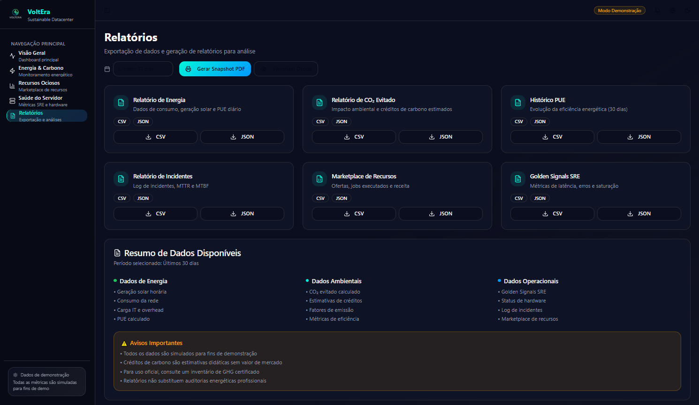

# GreenPulse by VoltEra

<p align="center">
  
</p>

<p align="center">
  <b>Monitoramento inteligente de energia, recursos e saúde operacional para ambientes críticos.</b>
</p>

<p align="center">
  <!-- Badges recomendados por devs modernos -->
  <a href="https://github.com/Samurai33/GreenPulse" target="_blank">
    
  </a>
  <a href="https://github.com/Samurai33/GreenPulse/fork" target="_blank">
    
  </a>
  <a href="https://github.com/Samurai33/GreenPulse/actions" target="_blank">
    
  </a>
  <a href="https://github.com/Samurai33/GreenPulse/issues" target="_blank">
    
  </a>
  <a href="https://github.com/Samurai33/GreenPulse/pulls" target="_blank">
    
  </a>
  <a href="https://github.com/Samurai33/GreenPulse/blob/main/LICENSE" target="_blank">
    
  </a>
  <a href="https://github.com/Samurai33/GreenPulse" target="_blank">
    
  </a>
  <a href="https://github.com/Samurai33/GreenPulse" target="_blank">
    
  </a>
</p>

---

## ✨ Diferenciais

- Visualização em tempo real de KPIs críticos (Energia, Carbono, SRE, Marketplace)
- Alertas inteligentes e personalizáveis (críticos, warning, info)
- Interface responsiva e moderna (React + Tailwind)
- Simulação de dados para testes e demonstrações
- Exportação de relatórios em CSV/JSON/PDF
- Arquitetura escalável e modular
- Marketplace de recursos computacionais
- Monitoramento de saúde operacional (Golden Signals, hardware, incidentes)

## 📷 Exemplos Visuais

<p align="center">
  
  
  
  
</p>

## 🚀 Tecnologias & Dependências

- [React](https://react.dev/)
- [TypeScript](https://www.typescriptlang.org/)
- [Vite](https://vitejs.dev/)
- [TailwindCSS](https://tailwindcss.com/)
- [shadcn/ui](https://ui.shadcn.com/) (componentes UI)
- [Radix UI](https://www.radix-ui.com/)
- [Lucide Icons](https://lucide.dev/)
- [TanStack Query](https://tanstack.com/query)
- [Recharts](https://recharts.org/)
- [date-fns](https://date-fns.org/)
- [ESLint](https://eslint.org/)

## 📦 Instalação

```sh
# Clone o repositório
$ git clone https://github.com/Samurai33/GreenPulse.git
$ cd GreenPulse
$ npm install
```

## 🏃‍♂️ Uso em Desenvolvimento

```sh
npm run dev
```
Acesse: http://localhost:5173

## 🏗️ Build para Produção

```sh
npm run build
npm run preview
```
Acesse: http://localhost:4173

## 🛠️ Scripts

- `npm run dev`: Inicia ambiente de desenvolvimento
- `npm run build`: Gera build de produção
- `npm run preview`: Preview do build
- `npm run lint`: Executa análise de código

## 📂 Estrutura Real do Projeto

```
GreenPulse/
├── bun.lockb
├── components.json
├── data/
│   ├── alerts.json
│   ├── energy_timeseries.json
│   ├── marketplace.json
│   └── sre_metrics.json
├── eslint.config.js
├── index.html
├── package-lock.json
├── package.json
├── postcss.config.js
├── public/
│   ├── favicon.ico
│   ├── placeholder.svg
│   └── robots.txt
├── README.md
├── src/
│   ├── App.css
│   ├── App.tsx
│   ├── assets/
│   │   ├── exemple1.png
│   │   ├── exemple2.png
│   │   ├── exemple3.png
│   │   ├── exemplo4.png
│   │   └── voltera-logo.png
│   ├── components/
│   │   ├── alerts/
│   │   │   └── alerts-table.tsx
│   │   ├── charts/
│   │   │   ├── energy-area-chart.tsx
│   │   │   └── pue-gauge.tsx
│   │   ├── layout/
│   │   │   ├── app-sidebar.tsx
│   │   │   └── dashboard-layout.tsx
│   │   └── ui/
│   │      └── [diversos componentes UI]
│   ├── hooks/
│   │   ├── use-mobile.tsx
│   │   └── use-toast.ts
│   ├── index.css
│   ├── lib/
│   │   ├── kpis.ts
│   │   └── utils.ts
│   ├── main.tsx
│   ├── pages/
│   │   ├── Dashboard.tsx
│   │   ├── Energia.tsx
│   │   ├── Index.tsx
│   │   ├── NotFound.tsx
│   │   ├── Recursos.tsx
│   │   ├── Relatorios.tsx
│   │   └── Saude.tsx
│   └── vite-env.d.ts
├── tailwind.config.ts
├── tsconfig.app.json
├── tsconfig.json
├── tsconfig.node.json
└── vite.config.ts
```

## 🧩 Principais Funcionalidades

- **Dashboard**: Visão geral dos KPIs, alertas recentes, status operacional
- **Energia & Carbono**: Gráficos de consumo, geração solar, PUE, créditos de carbono
- **Recursos**: Marketplace de ofertas de CPU, GPU, Storage, jobs em execução
- **Saúde do Servidor**: Golden Signals SRE, status de hardware, incidentes, uptime, MTBF/MTTR
- **Relatórios**: Exportação de dados, geração de snapshots, filtros por período e formato
- **Alertas**: Sistema de alertas críticos, warning e informativos, com ações sugeridas
- **Simulação de Dados**: Arquivos JSON para testes e demonstrações

## 📊 Exemplos de Dados Simulados

- `data/alerts.json`: Alertas críticos, warning e info (ex: falha solar, S.M.A.R.T. disk, latência)
- `data/energy_timeseries.json`: Consumo horário, geração solar, PUE diário
- `data/sre_metrics.json`: Golden Signals, hardware, incidentes, uptime, MTBF/MTTR
- `data/marketplace.json`: Ofertas de recursos, jobs, status e preços

## 🧱 Componentes UI

- Botões, cards, tabelas, gráficos, badges, menus, sidebar, toast, dialog, etc. (baseados em shadcn/ui e Radix)
- Hooks customizados: `useIsMobile`, `useToast`
- Utilitários: `lib/kpis.ts` (cálculo de PUE, CO2, créditos), `lib/utils.ts` (classes CSS)

## 🗂️ Páginas

- `Dashboard.tsx`: KPIs, alertas, status geral
- `Energia.tsx`: Gráficos de energia, PUE, créditos de carbono
- `Recursos.tsx`: Marketplace de recursos, ofertas, jobs
- `Saude.tsx`: Golden Signals, hardware, incidentes, uptime
- `Relatorios.tsx`: Exportação de dados, snapshots, disclaimers
- `NotFound.tsx`: Página 404 customizada

## 🧪 Testes & Qualidade

- ESLint configurado para TypeScript e React
- Scripts de lint disponíveis (`npm run lint`)
- Recomenda-se uso de testes unitários para funções críticas (ex: KPIs)

## 🚀 Deploy

- Build otimizado via Vite
- Preview local: `npm run preview`
- Deploy rápido via [Lovable](https://lovable.dev/projects/50c738ce-1a80-4611-b3fe-2bd49f703818)
- Suporte a domínio customizado ([docs](https://docs.lovable.dev/features/custom-domain#custom-domain))

## 🤝 Contribuição

Pull requests são bem-vindos! Siga o padrão de código, escreva testes e descreva claramente suas mudanças.

1. Fork este repositório
2. Crie uma branch (`git checkout -b feature/nome-feature`)
3. Commit suas alterações (`git commit -am 'feat: minha feature'`)
4. Push para a branch (`git push origin feature/nome-feature`)
5. Abra um Pull Request

## 📑 Licença

MIT © Samurai33

## 📬 Contato & Links Úteis

- [samurai33@github.com](mailto:samurai33@github.com)
- [Documentação React](https://react.dev/)
- [Documentação Vite](https://vitejs.dev/)
- [Documentação TailwindCSS](https://tailwindcss.com/)
- [shadcn/ui](https://ui.shadcn.com/)
- [Radix UI](https://www.radix-ui.com/)
- [Lovable Deploy](https://lovable.dev/)

---

# Documentação do Projeto GreenPulse (Dashboard VoltEra)

## Visão Geral

GreenPulse é o dashboard oficial do sistema VoltEra, responsável pelo monitoramento, visualização e controle dos principais indicadores de energia, recursos computacionais e saúde operacional em ambientes críticos. Ele integra dados do backend VoltEra, apresenta KPIs em tempo real, permite exportação de relatórios e oferece interface para alertas e marketplace de recursos.

## Índice
- [Visão Geral](#visão-geral)
- [Arquitetura](#arquitetura)
- [Funcionalidades](#funcionalidades)
- [Estrutura de Pastas](#estrutura-de-pastas)
- [Fluxo de Dados](#fluxo-de-dados)
- [Componentes Principais](#componentes-principais)
- [Integração com VoltEra](#integração-com-voltera)
- [Instalação e Execução](#instalação-e-execução)
- [Scripts Disponíveis](#scripts-disponíveis)
- [Testes e Qualidade](#testes-e-qualidade)
- [Deploy e Ambiente](#deploy-e-ambiente)
- [Contribuição](#contribuição)
- [Licença](#licença)
- [Referências](#referências)

## Arquitetura
- **Frontend:** React + TypeScript + Vite + TailwindCSS
- **Backend (VoltEra):** API REST/GraphQL (não incluso neste repositório)
- **Dados simulados:** Arquivos JSON para desenvolvimento e demonstração
- **Componentização:** UI modular baseada em shadcn/ui e Radix UI

## Funcionalidades
- Visualização de KPIs críticos (Energia, Carbono, SRE, Marketplace)
- Alertas inteligentes e personalizáveis
- Exportação de relatórios (CSV, JSON, PDF)
- Marketplace de recursos computacionais
- Monitoramento de saúde operacional (Golden Signals, hardware, incidentes)
- Interface responsiva e moderna
- Simulação de dados para testes

## Estrutura de Pastas
```
GreenPulse/
├── src/
│   ├── assets/         # Imagens e ícones
│   ├── components/     # Componentes (UI, gráficos, tabelas, layout)
│   ├── hooks/          # Hooks customizados
│   ├── lib/            # Funções utilitárias e KPIs
│   ├── pages/          # Páginas principais
│   └── ...
├── data/               # Dados simulados (JSON)
├── public/             # Arquivos estáticos
├── ...
```

## Fluxo de Dados
- Dados reais: obtidos via API VoltEra
- Dados simulados: arquivos em `/data` para desenvolvimento
- KPIs calculados em tempo real via funções utilitárias
- Alertas e incidentes exibidos e atualizados dinamicamente

## Componentes Principais
- **Dashboard:** Visão geral dos KPIs e alertas
- **Energia & Carbono:** Gráficos de consumo, geração solar, PUE, créditos de carbono
- **Recursos:** Marketplace de ofertas de CPU, GPU, Storage
- **Saúde do Servidor:** Golden Signals, hardware, incidentes, uptime
- **Relatórios:** Exportação de dados, snapshots, disclaimers
- **Alertas:** Sistema de alertas críticos, warning e informativos

## Integração com VoltEra
- Endpoints de API para ingestão de dados de energia, recursos, incidentes e alertas
- Autenticação e autorização (quando aplicável)
- Suporte a WebSocket/Streaming para dados em tempo real (opcional)

## Instalação e Execução
```sh
# Clone o repositório
$ git clone https://github.com/Samurai33/GreenPulse.git
$ cd GreenPulse
$ npm install
$ npm run dev
```
Acesse: http://localhost:5173

## Scripts Disponíveis
- `npm run dev`: Ambiente de desenvolvimento
- `npm run build`: Build de produção
- `npm run preview`: Preview do build
- `npm run lint`: Análise de código

## Testes e Qualidade
- ESLint configurado para TypeScript e React
- Recomenda-se uso de testes unitários para funções críticas (ex: KPIs)
- Testes de integração podem ser implementados para endpoints VoltEra

## Deploy e Ambiente
- Build otimizado via Vite
- Deploy via Lovable ou ambiente customizado
- Suporte a domínio customizado

## Contribuição
- Fork, branch, commit, pull request
- Siga o padrão de código e escreva testes

## Licença
MIT © Samurai33

## Referências
- [Documentação React](https://react.dev/)
- [Documentação Vite](https://vitejs.dev/)
- [Documentação TailwindCSS](https://tailwindcss.com/)
- [shadcn/ui](https://ui.shadcn.com/)
- [Radix UI](https://www.radix-ui.com/)
- [Lovable Deploy](https://lovable.dev/)
- [VoltEra API Docs] (interna)

---

> Para projetos corporativos, recomenda-se incluir documentação de API, manual do usuário, guia de integração, arquitetura detalhada, fluxos de autenticação/autorização, exemplos de payloads, e instruções de troubleshooting.
